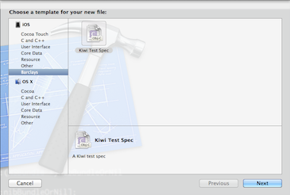
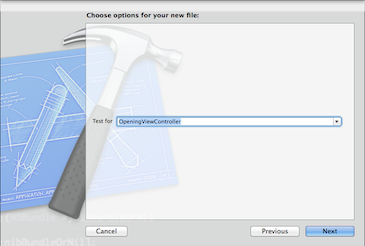
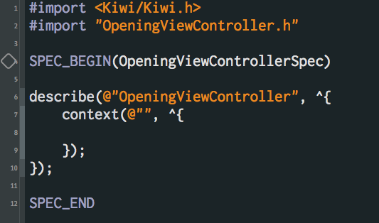

## Barclays File Templates

### Installation
1. Download the compressed file and unzip it to a known location
2. Open terminal and `cd` into the base directory `barclays_templates`
3. Run the following command: `bash install.sh`
4. Quit Xcode and restart
5. You should now see a Barclays group whenever you attempt to create a new file. All custom templates are in here.

This will install the templates into your user directory, and should persist even when we have to upgrade to new versions of Xcode.

Now, when you create new files, you should see a Barclays option in the sidebar:

And when you select that file, you just have to enter the name of the class you want to test. The template takes care of the rest:

The resulting file will already have imported the class from the previous step, and will have the skeleton of a typical Kiwi test:

